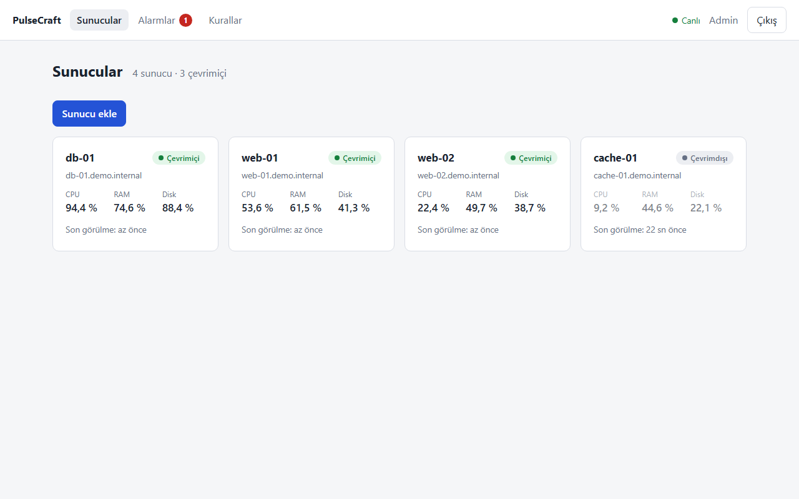
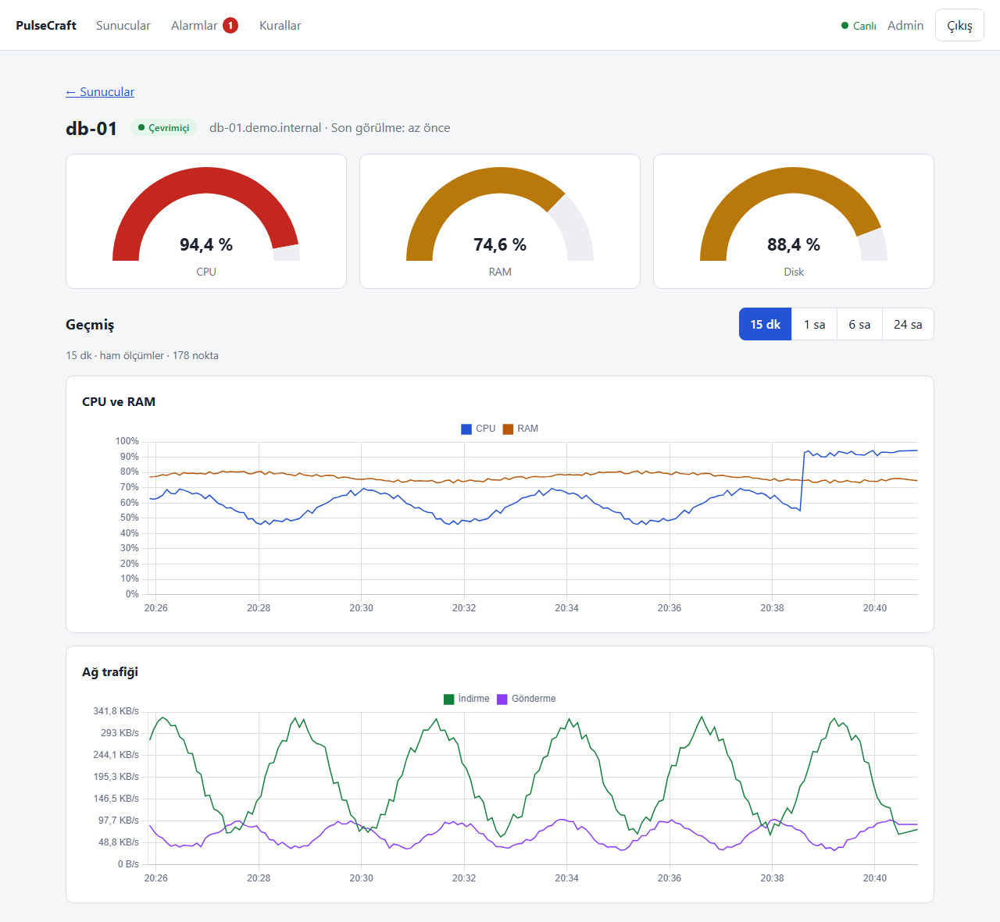
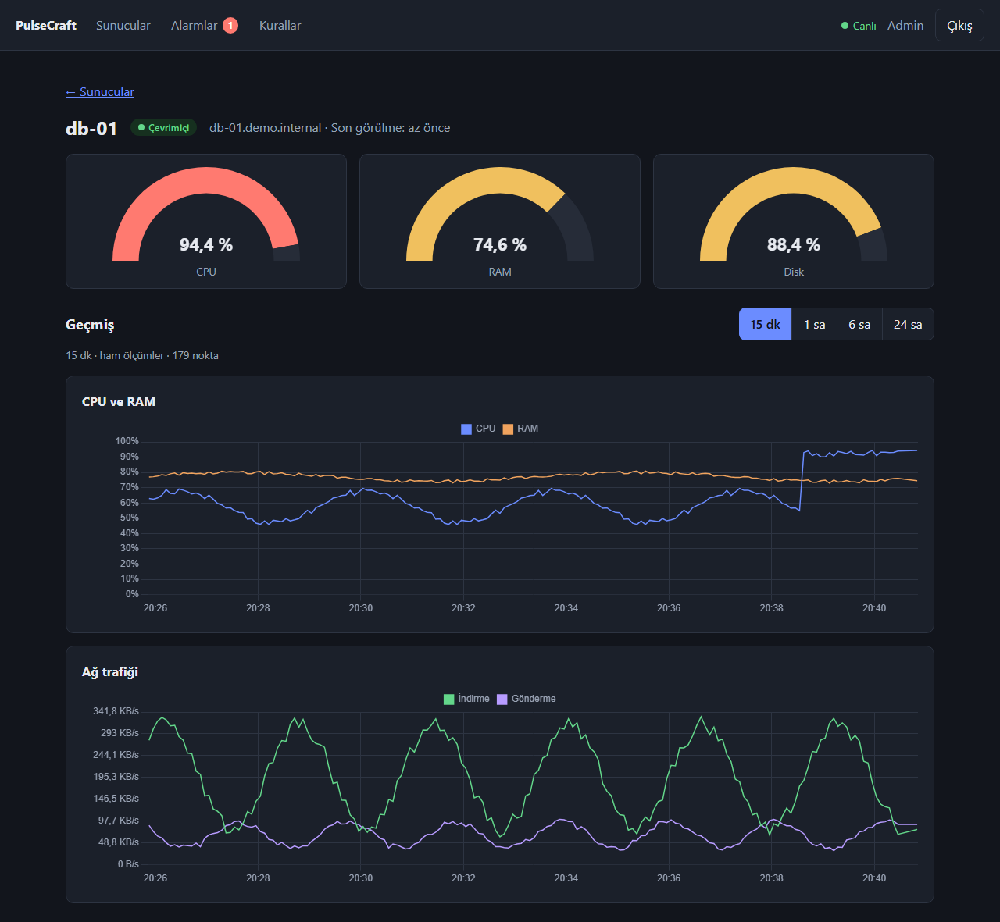
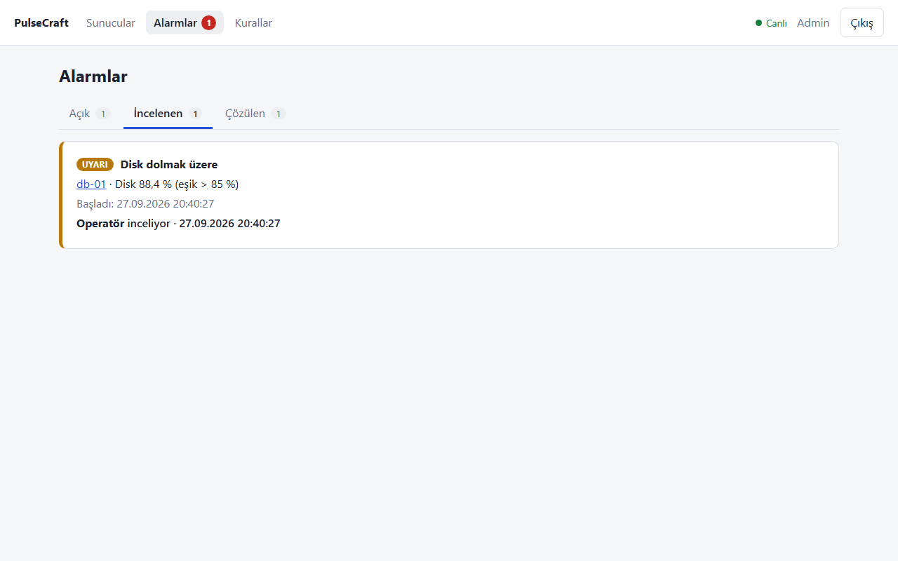
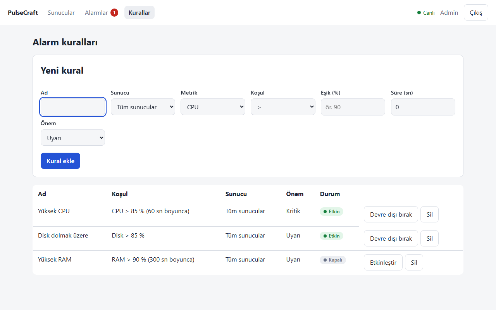
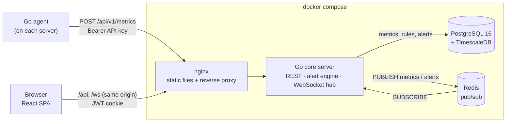

# PulseCraft

A self-hosted server monitoring system: a lightweight **Go agent** collects CPU, memory, disk and network
metrics, a **Go core server** stores them in **TimescaleDB** and evaluates alert rules, and a **React
dashboard** shows everything live over WebSocket — including a shared alert board where a team can see who
is handling which alert. The whole stack starts with a single `docker compose up`.

> The user interface is in **Turkish** (the screenshots below too). The code, API and this README are in
> English. A short Turkish summary is at the [end of this file](#türkçe-özet).



## Features

- **Agent** — single static Go binary; CPU %, RAM % / used bytes, disk %, network rx/tx bytes per second
  and load average. Buffers up to 1000 samples in memory and retries with exponential backoff when the
  server is unreachable, then sends the backlog in one batch.
- **Live dashboard** — server cards with online/offline status (computed on the server, not from the
  browser's clock), a detail page with gauges and time-series charts (15 min / 1 h raw data streamed live;
  6 h / 24 h from a 1-minute continuous aggregate).
- **Alert rules** — per metric (CPU / RAM / disk), threshold, optional "for N seconds" duration, severity,
  scope (all servers or one); disabling a rule resolves its open alerts immediately.
- **Shared alert board** — *Open / Acknowledged / Resolved* tabs; "I'm on it" (acknowledge) is pushed to
  every connected user instantly, showing who took the alert. Double-acknowledge is rejected atomically.
- **Server management** — add a server in the UI (its API key is shown exactly once), delete it with a
  type-the-name confirmation.
- **Authentication** — demo users seeded from `.env`, bcrypt password hashes, JWT in an `HttpOnly`,
  `SameSite=Strict` cookie, server-side logout (token revocation) that also closes the user's open WebSocket.

<table>
  <tr>
    <td></td>
    <td></td>
  </tr>
  <tr>
    <td></td>
    <td></td>
  </tr>
</table>

## Architecture



How a sample flows through the system:

1. The agent posts a batch of samples with its API key (only a SHA-256 hash of the key is stored).
2. The server writes the batch in one `INSERT … SELECT FROM unnest(…) ON CONFLICT DO NOTHING` query, so a
   batch re-sent after a timeout cannot create duplicate rows (`UNIQUE (node_id, time)`).
3. The alert engine evaluates every sample against the cached rules. Durations are measured with the
   **sample** timestamps, so a delayed backlog is still evaluated correctly. At most one active alert per
   rule and server is guaranteed by a partial unique index.
4. The newest sample and all alert events are published to Redis; every server instance's WebSocket hub
   forwards them to connected browsers. Slow clients are dropped instead of slowing everybody down.
5. The browser treats WebSocket events as hints: they are applied idempotently, and after every reconnect
   (and every 60 s as a safety net) the state is re-synchronised from the REST API.

The reasoning behind these choices, and the bugs that led to some of them, is written up in
[docs/decisions.md](docs/decisions.md).

## Quick start

Requirements: **Docker** with Compose v2 or newer. (Go 1.27 is only needed to run the agent outside Docker, Node 24
only for frontend development.)

```powershell
git clone https://github.com/Kenanakn0/PulseCraft.git
cd PulseCraft\deploy
copy .env.example .env      # macOS / Linux: cp .env.example .env
```

Edit `deploy/.env` **before the first start**:

| Variable | What to do |
| --- | --- |
| `JWT_SECRET` | **Required**, at least 32 characters — the server refuses to start otherwise. Generate one (see below). |
| `POSTGRES_PASSWORD` | Replace the placeholder. |
| `DEMO_USERS` | `email:password:Display name`, separated by `;`. Change the placeholder passwords (8–72 bytes, no `:` `;` `$` `#` or quotes). |
| `WEB_PORT` | Port of the web UI on `127.0.0.1` (default `8080`). |

Generate a `JWT_SECRET`:

```powershell
# PowerShell
$b = [byte[]]::new(48); [Security.Cryptography.RandomNumberGenerator]::Create().GetBytes($b); [Convert]::ToBase64String($b)
```

```bash
# macOS / Linux
openssl rand -base64 48
```

Then start the stack:

```powershell
docker compose up -d --build
docker compose ps           # wait until db, redis, server and nginx are "healthy"
```

Open <http://localhost:8080> and sign in with one of the users from `DEMO_USERS`.

> All published ports (web UI, PostgreSQL `5432`, Redis `6379`) are bound to `127.0.0.1` only. If a local
> PostgreSQL or Redis already uses those ports, change `DB_PORT` / `REDIS_PORT` in `.env`.

### Connect a server (agent)

1. In the UI click **Sunucu ekle** (*Add server*), enter a name and copy the API key with **Kopyala**
   (*Copy*). The key is shown only once.
2. Run the agent from the repository root:

   ```powershell
   go -C agent run ./cmd/agent "-server=http://localhost:8080" "-hostname=web-01"
   ```

   The agent asks for the API key **without echoing it**; paste it and press Enter. Within a few seconds
   the card turns *Çevrimiçi* (online).

The key is deliberately never passed on the command line (where it would end up in the shell history and
the process list). For services and containers, put it in a file instead:

| Flag | Environment variable | Default | Description |
| --- | --- | --- | --- |
| `-server` | `PULSECRAFT_SERVER_URL` | `http://localhost:8080` | Address of the web entry point (nginx). |
| `-api-key-file` | `PULSECRAFT_API_KEY_FILE` | — | File containing the API key (UTF-8 or UTF-16, surrounding whitespace ignored). |
| `-interval` | `PULSECRAFT_INTERVAL` | `3s` | Collection interval. |
| `-hostname` | `PULSECRAFT_HOSTNAME` | — | Hostname shown in the UI. **Not sent at all unless set** — the agent never reads the machine name on its own. |

Exit codes: `2` = invalid configuration or missing key, `3` = the server rejected the key (HTTP 401).
In PowerShell, always quote `-flag=value` arguments as shown above.

### Demo agent container (optional)

The compose file contains an example agent in the `demo` profile. It reads its key from
`deploy/secrets/demo-agent.key` (the folder is git-ignored except its README):

```powershell
# in deploy/, after "Sunucu ekle" → "Kopyala" in the UI
Get-Clipboard | Set-Content -NoNewline secrets\demo-agent.key
docker compose --profile demo up -d --build demo-agent
```

## Tech stack

| Area | Technologies |
| --- | --- |
| Agent | Go, [gopsutil](https://github.com/shirou/gopsutil), `log/slog` |
| Server | Go, [chi](https://github.com/go-chi/chi), [pgx](https://github.com/jackc/pgx), [go-redis](https://github.com/redis/go-redis), [coder/websocket](https://github.com/coder/websocket), golang-jwt, bcrypt |
| Storage | PostgreSQL 16 + TimescaleDB (hypertable, compression after 7 days, 30-day raw retention, 1-minute continuous aggregate kept 180 days), Redis 7 (pub/sub, AOF) |
| Frontend | React 19, TypeScript, Vite, React Router, Chart.js (`react-chartjs-2`), plain CSS with light/dark themes |
| Delivery | Docker multi-stage builds (non-root, static binaries), nginx (same-origin reverse proxy, CSP, security headers) |
| Tests | Go `testing` (unit + integration against real PostgreSQL/Redis), Vitest + Testing Library, Playwright |

## Security notes

- **Agent keys**: 256-bit random, shown once, stored only as SHA-256 hashes; deleting a server invalidates
  its key immediately.
- **Sessions**: HS256 JWT with a fixed algorithm list (no `alg` confusion / `none`), 8-hour expiry,
  `HttpOnly` + `SameSite=Strict` cookie (`Secure` via `COOKIE_SECURE=true` behind HTTPS). Logout revokes
  the token server-side and closes that session's WebSocket (close code `4401`).
- **Login**: rate limited to 10 attempts per minute per IP; unknown user and wrong password take the same
  time and return the same message. `X-Forwarded-For` is only trusted from the nginx container's fixed IP.
- **WebSocket**: requires a session and a same-origin `Origin` header.
- **nginx**: strict Content-Security-Policy (no inline scripts), `X-Frame-Options: DENY`, `nosniff`,
  `Referrer-Policy: no-referrer`. The server itself is not published to the host.
- **Every API route requires a session** except `/healthz`, login/logout and the agent's metrics
  endpoint — a test walks the router and fails if a new route is left unprotected.

This is a portfolio project: there is no TLS termination, user management or password reset. Put it behind
an HTTPS reverse proxy (and set `COOKIE_SECURE=true`) before exposing it beyond localhost.

## Development and tests

```powershell
# Go (unit tests; integration tests are skipped unless the variables below are set)
go -C server test ./...
go -C agent test ./...

# Frontend
cd web
npm ci
npm run dev          # Vite on http://localhost:5173, proxies /api and /ws to the stack on :8080
npm run typecheck
npm run lint
npm test             # Vitest
```

Tests that need real services — **run them only against a throw-away stack with fake credentials**, as
they create servers, rules and alerts:

| Command | Needs |
| --- | --- |
| `go -C server test ./internal/api -run Integration` | `PULSECRAFT_TEST_DATABASE_URL`, `PULSECRAFT_TEST_REDIS_URL` |
| `npm run e2e` (Playwright, starts Vite) | `E2E_EMAIL`, `E2E_PASSWORD`; two-user tests also `E2E_EMAIL2`, `E2E_PASSWORD2` |
| `npm run smoke` (against the built nginx image) | `SMOKE_BASE_URL`, `E2E_EMAIL`, `E2E_PASSWORD` |
| `npm run docs:shots` (regenerates the screenshots in this README with fictional data) | an **empty** stack, `SHOTS_BASE_URL`, `SHOTS_ADMIN_*`, `SHOTS_OPS_*` |

Tip: a second copy of the stack can run next to your real one with its own project name, env file and
volumes, e.g. `docker compose -p pulsecraft-test --env-file test.env up -d --build` (adjust the ports and
the fixed subnet in a copy of the compose file first).

## Project layout

```
agent/     Go module: metric collection, buffered sender, agent Dockerfile
server/    Go module: REST API, auth, alert engine, Redis publisher, WebSocket hub
web/       React + TypeScript frontend, Vitest/Playwright tests, nginx image Dockerfile
deploy/    docker-compose.yml, .env.example, database schema, nginx config, secrets folder
docs/      design decisions, screenshots
```

## Known limitations

- Revoked tokens and the login rate limiter live in the server's memory: they reset on restart and assume a
  single server instance.
- On Docker Desktop all requests from the host reach the server through one gateway address, so the
  login rate limit counts all local clients together (on Linux the real client IP is seen).
- WebSocket events can be delayed or dropped during a Redis outage; the UI recovers through REST
  re-synchronisation (on reconnect and every 60 s).
- The 6 h / 24 h charts use the 1-minute aggregate, which lags a few minutes behind live data.
- The rule list itself is not live: changes by other users appear on the next 30-second refresh.

## Next steps

- Animated GIF of the live dashboard in this README.
- Notifications (e-mail / webhook) for alerts.
- Tagged agent releases (`go install github.com/Kenanakn0/pulsecraft/agent/cmd/agent@latest`).

## Türkçe özet

PulseCraft, kendi sunucunuzda çalışan bir sunucu izleme sistemidir. Her sunucuya kurulan **Go agent**'ı
CPU, RAM, disk ve ağ ölçümlerini toplayıp **Go core server**'a gönderir; server ölçümleri **TimescaleDB**'ye
yazar, alarm kurallarını işletir ve **Redis Pub/Sub + WebSocket** ile tarayıcıya canlı yayınlar. **React**
arayüzünde (Türkçe) sunucu kartları, canlı grafikler, alarm kuralları ve ekibin ortak kullandığı bir alarm
panosu vardır: biri bir alarmı "İncelemeye aldım" dediğinde herkesin ekranında anında görünür.

Kurulum: `deploy/.env.example` dosyasını `.env` olarak kopyalayın, `JWT_SECRET` (en az 32 karakter),
`POSTGRES_PASSWORD` ve `DEMO_USERS` parolalarını değiştirin, `deploy` klasöründe
`docker compose up -d --build` çalıştırın ve <http://localhost:8080> adresini açın. Sunucu eklemek için
arayüzde **Sunucu ekle** → anahtarı **Kopyala** → depo kökünde
`go -C agent run ./cmd/agent "-server=http://localhost:8080"` (anahtar ekranda gösterilmeden sorulur).

## License

[MIT](LICENSE)
